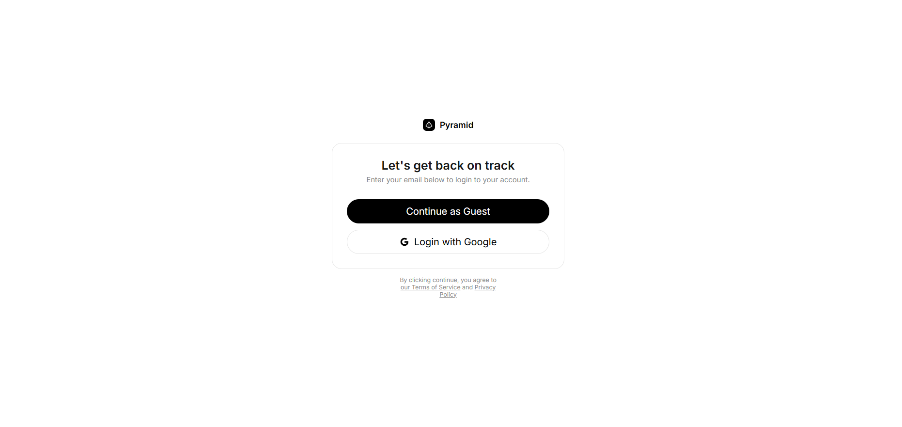
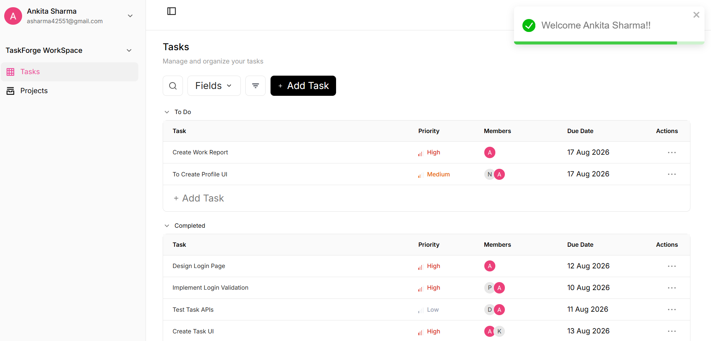
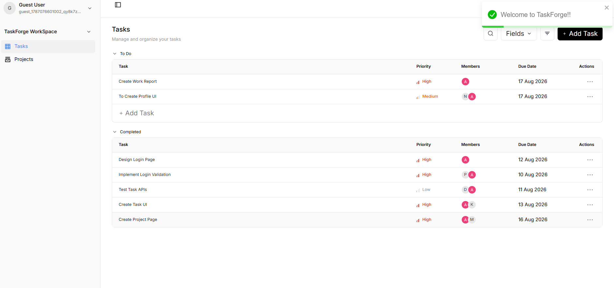
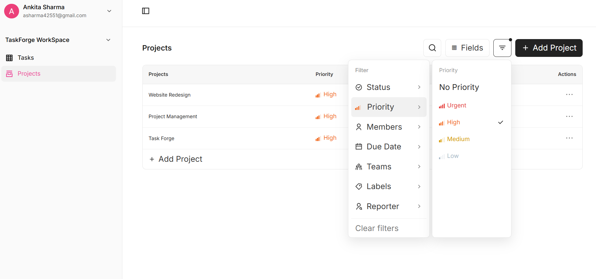
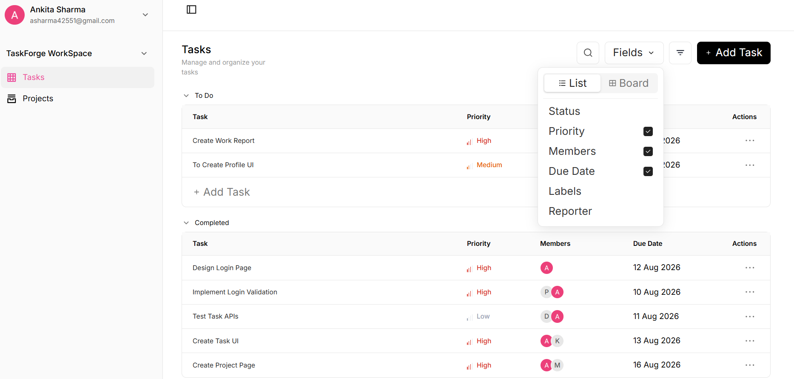
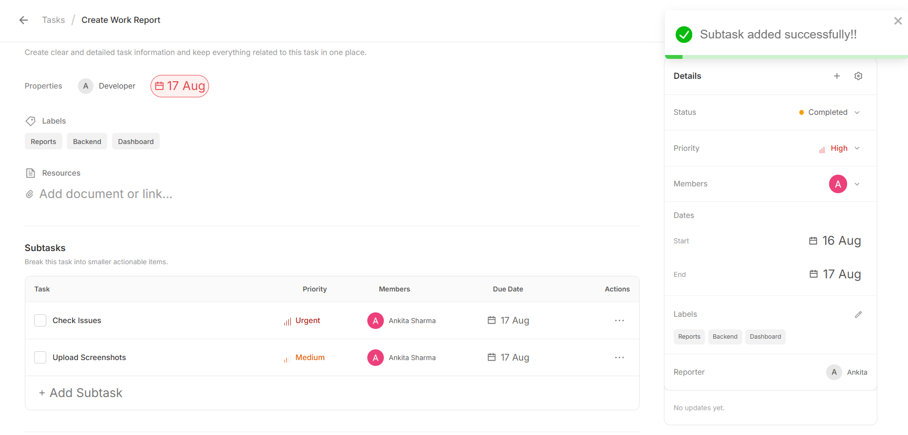
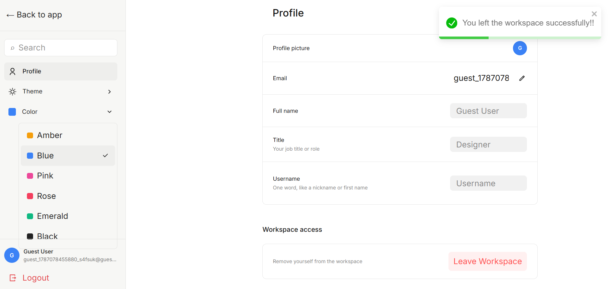

# TaskForge – Task Management System

TaskForge is a responsive task management application developed as part of the assessment task. The application is based on the provided Figma design and focuses on task management, project and workspace management, authentication, theme customization and a responsive user experience.

## Live Demo

**Frontend:** https://taskforge-frontend-g4qd.onrender.com

**Backend API:** https://taskforge-2026.onrender.com

## GitHub Repository

**GitHub:** https://github.com/ankita12sharma/TaskForge_2026

---

## Features

### Authentication

- User login and registration
- Guest login
- Logout functionality
- Protected application routes

### Workspace Management

- Create and manage workspaces
- Workspace selection
- Manage workspace members
- Add members
- Leave workspace

### Project Management

- Create and manage projects
- View project list
- Organize tasks by project
- Manage project details
- Project-based task organization

### Task Management

- Create and manage tasks
- Task filtering
- Task priority
- Due dates
- Labels
- Member assignment
- Subtasks
- Comments and replies
- Task properties

### Profile

- View and update profile information
- Username
- Profile image
- Workspace information

### Themes & Colors

- Multiple theme options
- Theme switching
- Color selection through the color dropdown
- Selected theme and color preferences persist after page refresh

### Responsive Design

The application is designed to provide a responsive experience across:

- Desktop
- Laptop
- Tablet
- Mobile

---

## Tech Stack

### Frontend

- React.js
- Redux Toolkit
- RTK Query
- React Router
- JavaScript
- Vite
- Tailwind CSS

### Backend

- Node.js
- Express.js
- MongoDB
- Mongoose
- REST APIs

### Tools

- Git
- GitHub
- Postman
- VS Code

---

## Project Structure

```text
TaskForge/
│
├── client/
│   ├── src/
│   ├── public/
│   ├── .env.example
│   └── package.json
│
├── server/
│   ├── src/
│   ├── .env.example
│   └── package.json
│
├── TaskForge_Images/
│
├── .gitignore
└── README.md
```

## Screenshots

### Google UI



### Google Login



### Guest Login



### Projects



### Task Management



### Subtasks



### Profile


